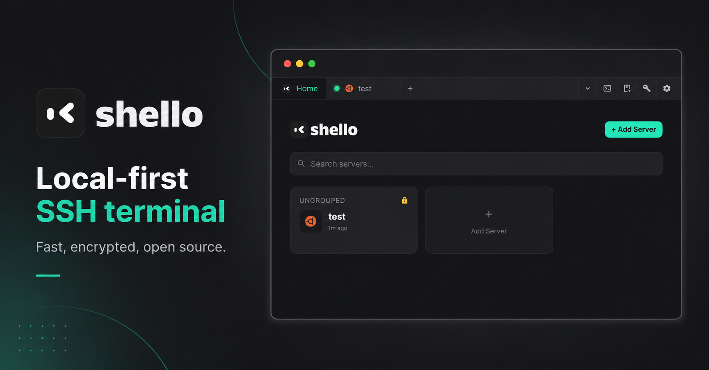

<p align="center">
  
</p>

# Shello

**Dive into any server.** Lightweight SSH client built with Tauri 2.0 + Vue 3 + Rust.

## Features

- **SSH terminal** — full PTY support, multiple concurrent sessions, OS detection, per-session logging.
- **Connection manager** — organize hosts into profiles and groups, with search and tags.
- **Encrypted vault** — passwords, passphrases, and keys are encrypted at rest behind a master password.
- **SSH key management** — generate and manage keys without leaving the app.
- **Snippets** — save and reuse common commands.
- **Recipes** — define multi-step command workflows and run them against any host.
- **Screenshots & recordings** — capture terminal output for sharing.

> **Local-first.** Everything is stored locally on your machine — no cloud account, no telemetry.

## Install

Download the latest build for your OS from [Releases](https://github.com/yolkmonday/shello/releases).

> Builds are **not yet code-signed**, so each OS shows a first-launch warning. Steps to bypass are below — this is expected for unsigned apps and is safe.

### macOS

Download the `.dmg`, open it, and drag **Shello.app** into `/Applications`.

On first launch macOS may say *"Shello.app is damaged"* or *"cannot be opened because the developer cannot be verified"*:

- **Right-click open:** Finder → `/Applications` → right-click **Shello.app** → **Open** → **Open** again. macOS remembers the choice afterward.
- **Or clear quarantine:** `xattr -dr com.apple.quarantine /Applications/Shello.app`

### Windows

Download the `.msi` (or `.exe`) and run it. SmartScreen may show *"Windows protected your PC"* — click **More info → Run anyway**.

### Linux

Download the `.AppImage` (portable), `.deb` (Debian/Ubuntu), or `.rpm` (Fedora/RHEL):

```sh
# AppImage — portable, no install
chmod +x Shello_*.AppImage && ./Shello_*.AppImage

# Debian / Ubuntu
sudo dpkg -i Shello_*.deb

# Fedora / RHEL
sudo rpm -i Shello_*.rpm
```

### Homebrew (planned)

A Homebrew cask is planned but not yet published.

> Code-signing + notarization are on the roadmap and will remove the first-launch warnings.

## Development

### Prerequisites

- [Rust](https://rustup.rs/) 1.77.2+
- [Bun](https://bun.sh/) 1.0+
- Xcode Command Line Tools (macOS): `xcode-select --install`

### Setup

```sh
bun install
bun run tauri dev
```

### Scripts

| Command | Description |
|---------|-------------|
| `bun run tauri dev` | Start the full app (Rust + Vite dev server) |
| `bun run tauri build` | Production build (packaged app) |
| `bun run dev` | Frontend only (Vite, no Tauri window) |
| `bun run build` | Type-check + build frontend assets |

## Tech Stack

- **Frontend:** Vue 3, TypeScript, Tailwind CSS v3, Pinia
- **Backend:** Rust, Tauri 2.0
- **Package Manager:** Bun

## Project Structure

    src/            # Vue 3 frontend (components, stores)
    src-tauri/      # Rust backend (ssh, vault, db, registry, commands)
    docs/           # Release docs

## Releasing

Tag pushes (`v*`) trigger `.github/workflows/release.yml`, which builds a universal `.dmg` (arm64 + x64) and uploads it to a GitHub Release. See [`docs/homebrew-tap.md`](docs/homebrew-tap.md) for tap setup and the cask update flow.

## Contributing

Issues and pull requests are welcome! Please read [CONTRIBUTING.md](./CONTRIBUTING.md) before submitting.

- **Bug reports** — [open an issue](https://github.com/yolkmonday/shello/issues) with OS, architecture, version, and steps to reproduce.
- **Feature requests** — open an issue to discuss before starting work.
- **Pull requests** — fork, branch from `main`, follow the [commit convention](./CONTRIBUTING.md#commit-convention), and open a PR.

### Development Setup

```sh
git clone https://github.com/yolkmonday/shello.git
cd shello
bun install
bun run tauri dev
```

See [CONTRIBUTING.md](./CONTRIBUTING.md) for full guidelines including the release process.

## Changelog

See [CHANGELOG.md](./CHANGELOG.md) for release history.

## License

[MIT](./LICENSE) © Ari Padrian
